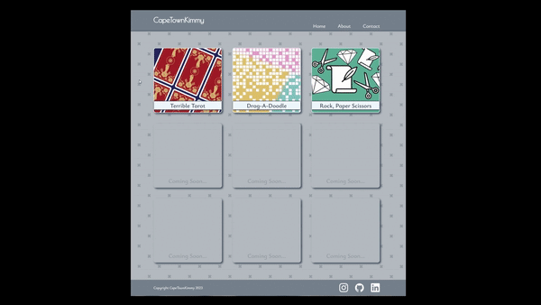

# Portfolio Project

For this *Codecademy* project, I built a personal portfolio site where I can share the projects I complete for *Codecademy* and *The Odin Project's* Full Stack Engineer courses. 

## Project Objectives:
* Build a website using HTML, CSS
* Add at least one interactive feature using JavaScript
* Use Git version control
* Use the command line and file navigation
* Develop locally on your computer
* Deploy your site to the web using GitHub Pages

---

### Have a look at my [Portfolio](capetownkimmy.github.io/Portfolio/)!

---
## Software & Skills:

* 
* 
* 
* 
* 
* 
* 

#

###### Badges from **Simply Badges** 

